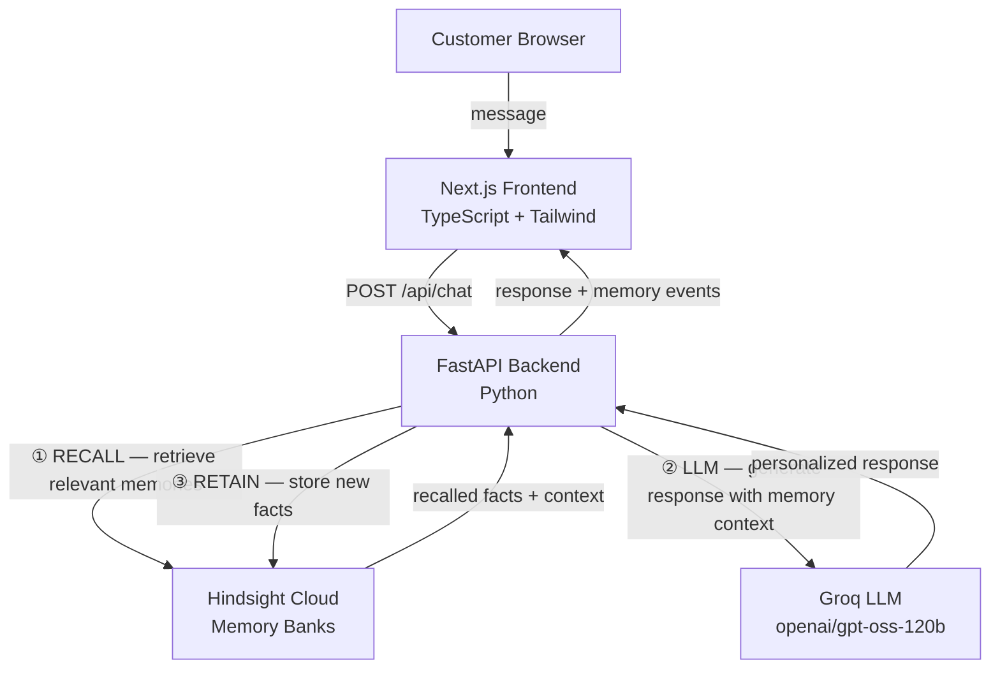
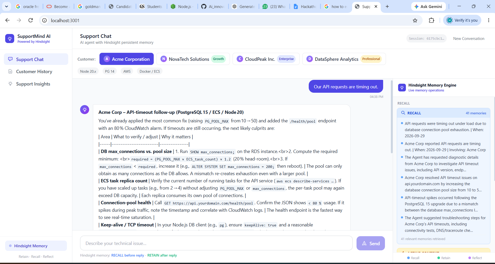
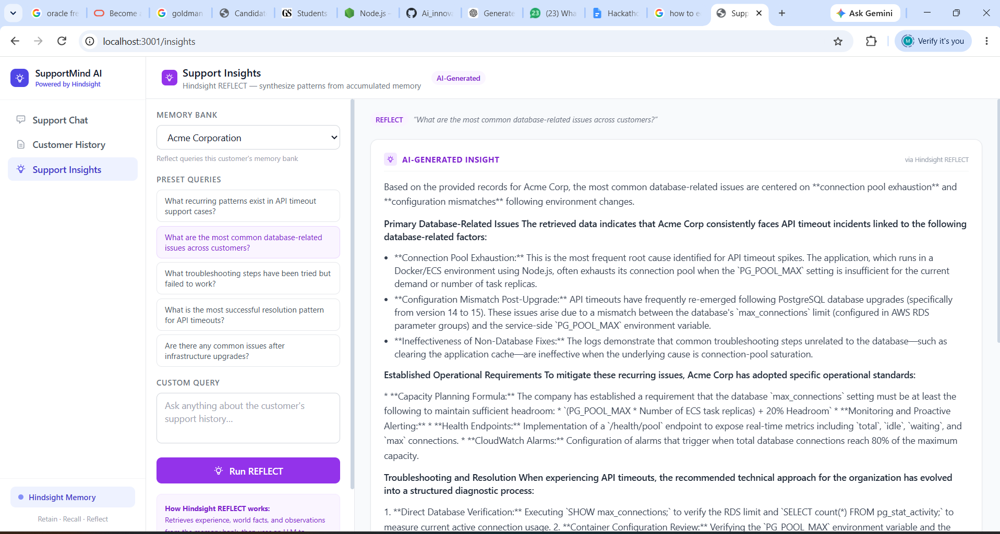

# Building AI Support Agents with Hindsight Memory

Support workflows are full of repeated questions: "What version are you on?", "What changed recently?", "Have you already tried the standard fix?" In a stateless AI agent, every ticket starts from zero. The system can answer the current message, but it cannot remember the customer's environment, failed attempts, or recurring issue patterns across tickets.

That is the problem the repository in front of me is designed to solve. SupportMind AI is a demo application built with a Next.js/React/TypeScript frontend and a Python/FastAPI backend, with Groq for LLM generation and Hindsight Cloud for persistent memory. The seed data in `backend/data/customers.py` and `backend/data/seed_data.py` is intentionally synthetic, but it reflects the real engineering challenge: a B2B support agent should not act like a blank slate every time a customer returns.

The important distinction is between storing chat history and storing memory. A chat transcript is useful as context for one conversation. Memory is reusable across conversations, customer sessions, and support issues. In a technical support setting, that difference matters because the same customer often reappears with a related problem, a new environment change, or a previously failing workaround.

## The Problem: Support Without Memory

A support agent that is only aware of the active thread is fundamentally limited. If a customer reports an API timeout again, the system does not know whether they are on the same stack, whether they recently upgraded PostgreSQL, whether a previous fix worked, or whether they already tried a cache clear and it failed. In a recurring support scenario, that quickly becomes frustrating and generic.

The repository's seeded customer data makes this concrete. For example, `acme-corp` includes an Enterprise environment profile with Node.js 20.x, PostgreSQL 14, Redis 7.0, AWS ECS/Docker, and an issue history that explicitly records a connection-pool problem and its resolution. The repository also includes a later note that PostgreSQL was upgraded from 14 to 15, which is the kind of environment change that matters to a technical support conversation.

This is not a social chat problem. It is an operational memory problem. The ideal support agent should remember:
- the customer's technical environment
- prior symptoms and their causes
- actions that failed
- actions that succeeded
- environment changes that may affect future incidents

Without that memory, ordinary chatbot behavior is insufficient for recurring technical support.

## Why This Matters for SupportMind AI

SupportMind AI is a small but real example of how memory changes the support workflow. The backend does not rely on a single conversation thread. Instead, it uses Hindsight as a memory layer for each customer. The core idea is straightforward:

1. Recall relevant memories before answering.
2. Generate the response with that context included.
3. Retain new facts after the exchange.
4. Reflect on accumulated patterns when needed.

This structure is visible in `backend/services/support_agent.py`, which is the operational heart of the project.

The implementation is intentionally direct: it uses Hindsight Cloud as a REST API, not a specialized SDK. In `backend/services/hindsight_service.py`, the repository defines explicit methods for `retain`, `recall`, and `reflect` using HTTP requests to `/{bank_id}/memories`, `/{bank_id}/memories/recall`, and `/{bank_id}/reflect`. That is a useful engineering choice because it keeps the memory layer explicit and inspectable.

## The Architecture

The app is divided into a browser UI, a Python API, and a Hindsight memory service.



The frontend uses Next.js 14, React 18, and TypeScript, as shown in `frontend/package.json`. The backend uses FastAPI and Python, with environment variables configured in `backend/config.py` and `.env.example`. The LLM is configured through Groq with `GROQ_MODEL`, defaulting to `openai/gpt-oss-120b`, and Hindsight is configured through `HINDSIGHT_BASE_URL` and `HINDSIGHT_API_KEY`.

The repository is an architectural example, not a production benchmark. It is a clear demonstration of how an agent memory layer fits into a support system without pretending that the full support workflow has been solved.

## Making Hindsight the Memory Layer

The memory layer is not an extra dashboard feature; it is the core of the support workflow. In `backend/services/support_agent.py`, the service calls Hindsight before generating a response:

```python
recall_data = await hindsight.recall(
    bank_id=customer_id,
    query=message,
    types=["world", "experience", "observation"],
    budget="mid",
    tags=[customer_id],
)
```

This is exactly the pattern used by the repo: a customer's bank is queried with the incoming ticket or issue text. The service then formats the result into a readable context string and passes it into the LLM. That is implemented in `llm_service.py`:

```python
def _build_system_message(recalled_context: Optional[str]) -> str:
    if not recalled_context:
        return SYSTEM_PROMPT
    return (
        SYSTEM_PROMPT
        + "\n\n--- CUSTOMER MEMORY CONTEXT ---\n"
        + recalled_context
        + "\n--- END CONTEXT ---\n"
        + "\nUse the above context to personalize your response."
    )
```

This is significant because the memory does not sit outside the model as an invisible sidecar. It is injected into the model context, so the response can reference the customer's known environment and earlier support outcomes.

The same repo also shows a second LLM call for fact extraction:

```python
async def extract_facts_to_retain(conversation_turn: str, ai_response: str) -> str:
    prompt = f"""Extract key facts from this support exchange that are worth remembering for future tickets.
    Focus on: environment details, problem description, solutions tried, outcomes, customer preferences.
    ...
    """
```

This is important because the system is not simply storing the raw chat transcript. It extracts facts such as environment details, problem description, solutions tried, outcomes, and customer preferences. That gives the memory layer more focused information to retrieve than storing every message verbatim.

## RECALL, LLM Response Generation, and RETAIN

The workflow is explicit and sequential:

1. RECALL — `hindsight.recall(...)`
2. LLM — `chat_completion(..., recalled_context=...)`
3. RETAIN — `hindsight.retain(...)`

This is visible in the main support turn function:

```python
# 1. RECALL
recall_data = await hindsight.recall(
    bank_id=customer_id,
    query=message,
    types=["world", "experience", "observation"],
    budget="mid",
    tags=[customer_id],
)

# 2. LLM — generate response using recalled context
ai_reply = await chat_completion(
    messages=messages,
    recalled_context=recalled_context if recalled_context else None,
)

# 3. RETAIN — extract and store facts from this exchange
facts_text = await extract_facts_to_retain(message, ai_reply)
retain_result = await hindsight.retain(
    bank_id=customer_id,
    content=facts_text,
    document_id=f"session_{session_id}",
    context=f"Support session {session_id}",
    metadata={"session_id": session_id, "customer_id": customer_id},
    tags=[customer_id],
)
```

The repository places `RECALL` before response generation and `RETAIN` after. That ordering matters. The agent should not answer from a blank context. It should answer from the customer's memory, then record the outcome for the next interaction.


## A Concrete Example from the Repo

The strongest example in the repository is the seeded `acme-corp` data. The memory bank is seeded with several facts, including:
- customer profile: Node.js 20.x, PostgreSQL 14, Redis 7.0, AWS ECS with Docker
- prior API timeout issue
- connection pool exhaustion as the root cause
- a failed attempt: clearing the application cache did not resolve the problem
- a successful fix: increasing the connection pool size from 10 to 50
- a later environment change: PostgreSQL upgraded from version 14 to version 15

These are not invented details. They are in `backend/data/seed_data.py`. In fact, the code explicitly states:

- `Ticket ACME-001: API requests timing out under load`
- `Root cause: database connection pool exhausted (pool size was 10)`
- `Failed attempt: clearing application cache — did NOT resolve the issue`
- `Successful resolution: increased connection pool size from 10 to 50`

This is exactly the kind of signal a support agent should remember. A later ticket asking about timeouts can pull relevant memories from the same bank, giving the support agent access to information from earlier incidents.

The same pattern exists for other customers as well. For example, `novatech` has webhook delays and Kubernetes/GKE context; `cloudpeak` has OAuth token refresh issues on Azure AKS; `datasphere` has connection-pool and large-dataset query context. The project demonstrates that memory is not generic; it is customer-specific and issue-specific.

<!-- Screenshot: Terminal showing Hindsight RECALL and RETAIN -->

## Why Persistent Memory Matters More Than Chat History

A chat transcript captures narrative. A memory bank captures facts and patterns. That distinction matters for support work.

Chat history can answer: "What did this customer say in this thread?"
Memory can answer: "What is the customer's environment, what has failed, what worked, and what changed?"

This lets the agent recognize:
- the environment is not the same as last time
- the same user has had this issue before
- the last fix may no longer apply
- the customer prefers certain response styles
- the likely root cause is tied to previous incidents

This makes the system useful because it keeps support context structured and retrievable across separate conversations.

## REFLECT: Memory as Insight

The repository also includes a `reflect` method:

```python
async def reflect(
    bank_id: str,
    query: str,
    budget: str = "low",
    max_tokens: int = 4096,
    tags: Optional[list[str]] = None,
    include_facts: bool = True,
) -> dict[str, Any]:
    payload = {
        "query": query,
        "budget": budget,
        "max_tokens": max_tokens,
        "include": {"facts": {} } if include_facts else {},
    }
```




`reflect` is the portion of the system that synthesizes patterns from accumulated memory. The repo clearly names this as a support-insights workflow. The system collects memory across a bank and can reason over customer-specific patterns. For example, a stored fact like "PostgreSQL upgrade from 14 to 15" alongside earlier connection-pool incidents creates a pattern that is useful to the support team. It is not the same thing as raw chat logs.

That is the value of memory: it supports both real-time support and longer-term operational understanding.

<!-- Screenshot: Architecture diagram showing RECALL → LLM → RETAIN loop -->

## Genuine Engineering Lessons

1. **Customer memory should be isolated by bank.**
   The repo uses `bank_id=customer_id` and tags like `[customer_id]`. This avoids mixing Acme's tickets with other customers and is a clean multi-tenant pattern for demo purposes.

2. **Retrieval is not the same as storing transcript.**
   The code intentionally extracts facts before retention, so the system isn't just dumping raw messages into a memory bank. That makes the memory layer more useful for targeted retrieval.

3. **Recall precedes generation for a reason.**
   In `support_agent.py`, the agent first retrieves relevant memory and only then calls the LLM. This separation is the core of the memory-aware support workflow.

4. **The direct HTTP interface is explicit and debuggable.**
   The repo does not hide Hindsight behind a custom SDK; it calls the REST API directly in `hindsight_service.py`, which makes request structure, payloads, and failures easy to inspect.

5. **REFLECT depends on the Hindsight service being properly configured.**
   The feature is useful, but it is not free-standing and requires appropriate infrastructure setup.

## Limitations

The repository is explicit about several constraints. The seeded data is synthetic; the application is a demo environment rather than a production support platform. The Hindsight API is used directly through HTTP, and `extract_facts_to_retain` has a fallback to raw conversation text if fact extraction fails. That fallback is visible in the code:

```python
except Exception as e:
    logger.warning("Fact extraction failed, retaining raw turn: %s", e)
    return f"Customer reported: {conversation_turn[:500]}"
```

That is a useful engineering guardrail, but it also shows the system is designed for demonstration and iterative improvement rather than a fully production-hardened support memory stack.

## Where Hindsight Fits

Hindsight is not a decoration in this project. It is the memory layer that turns a generic chatbot into a context-aware support agent. For technical support, that is the key difference between a conversational interface and a useful support system.

The project's core idea is simple: support doesn't need a better general-purpose chatbot; it needs a memory-aware support system that remembers customer context, prior fixes, and failed attempts. That is why persistent memory is central to this workflow.

The repository links to the official Hindsight resources directly, which is a good fit with the project's purpose:
- [Hindsight GitHub](https://github.com/vectorize-io/hindsight)
- [Hindsight documentation](https://hindsight.vectorize.io/)
- [What is Agent Memory?](https://vectorize.io/what-is-agent-memory)

This is a technical support memory pattern built around realistic synthetic customer data, explicit recall, and durable retention.
